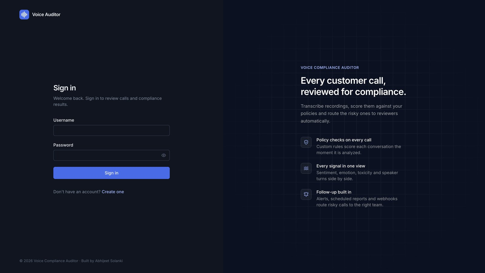
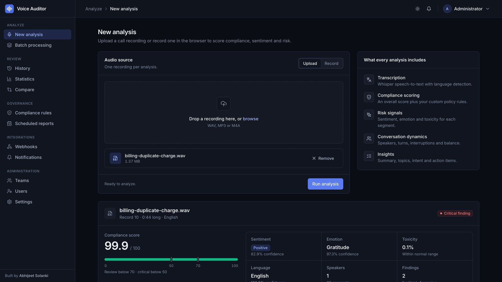
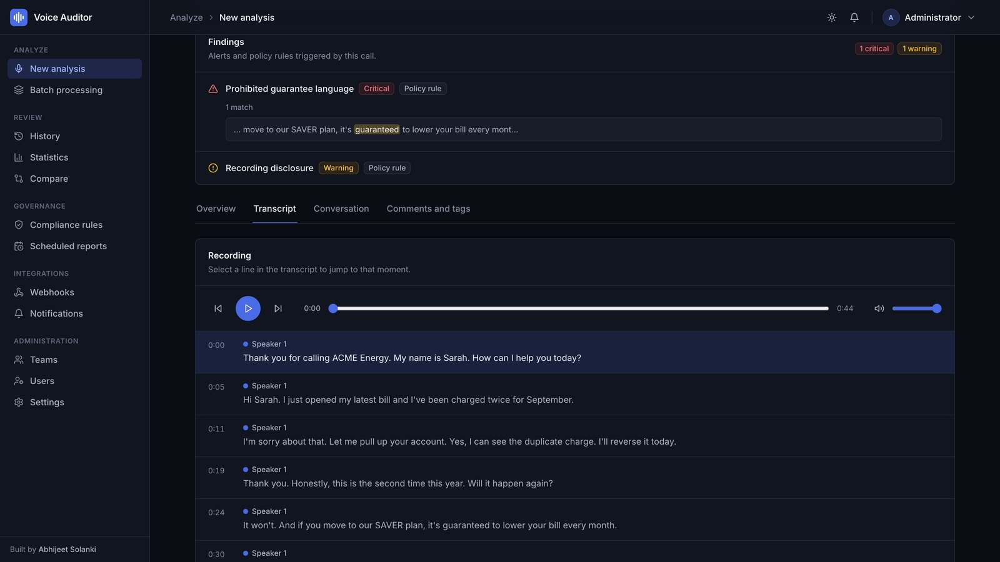
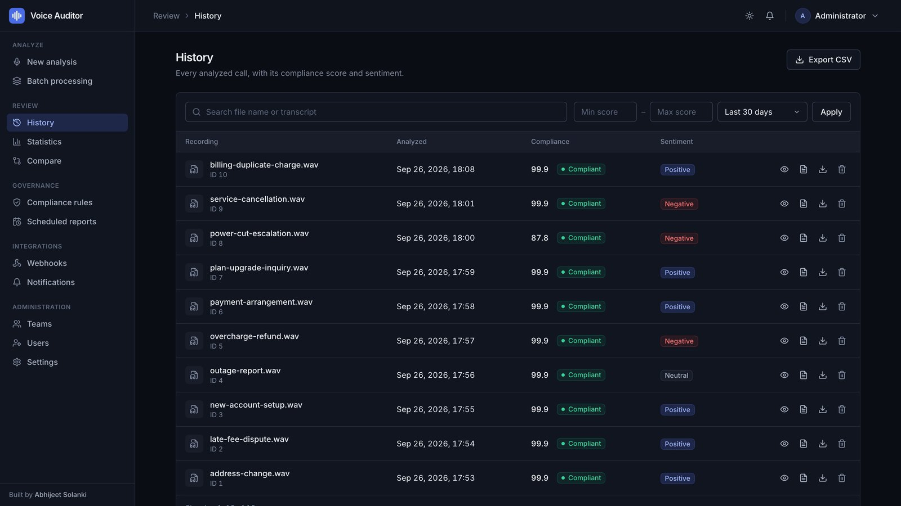
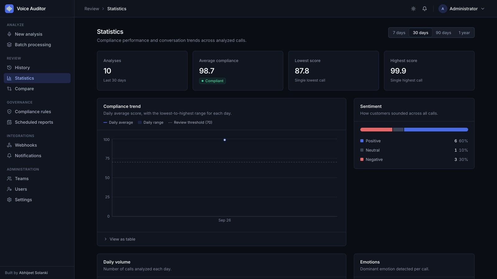
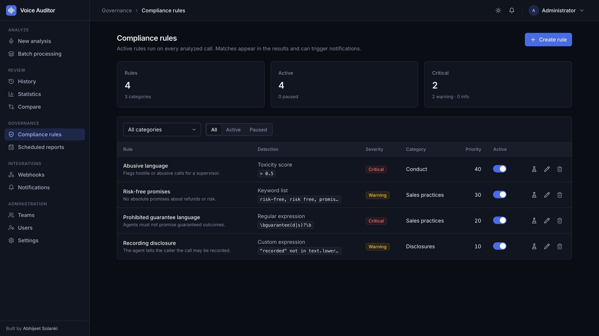

# 🎙️ AI Voice Compliance Auditor

<div align="center">

**AI-Powered Voice Conversation Analysis & Compliance Monitoring System**

[](https://www.python.org/)
[](https://fastapi.tiangolo.com/)
[](https://reactjs.org/)
[](https://www.typescriptlang.org/)
[](LICENSE)

**Developed with ❤️ by [Abhijeet Solanki](https://github.com/chiefaj)**

[Features](#-features) • [Installation](#-installation) • [Quick Start](#-quick-start) • [Documentation](#-documentation) • [Screenshots](#-screenshots)

</div>

---

## 📖 Overview

**AI Voice Compliance Auditor** is a comprehensive, enterprise-grade solution for analyzing voice conversations, monitoring compliance, and extracting actionable insights. Built with cutting-edge AI/ML technologies, it provides real-time analysis of audio recordings with features like sentiment analysis, toxicity detection, speaker diarization, multi-language support, and automated compliance reporting.

### Key Highlights

- 🎯 **Real-time Analysis**: Upload audio files or record directly in the browser
- 🌍 **Multi-Language Support**: Automatic language detection (including Hindi, English, and more)
- 🤖 **AI-Powered Insights**: Sentiment analysis, topic extraction, intent classification
- 📊 **Advanced Analytics**: Compliance scoring, conversation quality metrics, speaker analysis
- 🔔 **Automated Alerts**: Custom compliance rules, webhooks, and email notifications
- 👥 **Team Collaboration**: User authentication, comments, tags, and team management
- 📈 **Comprehensive Reports**: Automated scheduling, PDF generation, and historical tracking

---

## ✨ Features

### 🎯 Phase 1: Core Analysis Features

- ✅ **Audio Transcription** - High-quality speech-to-text using Whisper
- ✅ **Multi-Language Detection** - Automatic language detection with confidence scoring
- ✅ **Speaker Diarization** - Identify and separate different speakers
- ✅ **Sentiment Analysis** - Real-time sentiment tracking with timeline visualization
- ✅ **Toxicity Detection** - Identify inappropriate or toxic language
- ✅ **Compliance Scoring** - Overall compliance score (0-100) with detailed metrics
- ✅ **Conversation Analysis** - Turn-taking, interruptions, balance metrics
- ✅ **Audio Quality Analysis** - Technical quality metrics and recommendations
- ✅ **Keyword Detection** - Identify important keywords and phrases

### 🤖 Phase 2: Intelligence & Insights

- ✅ **AI-Powered Summarization** - Generate concise summaries using BART model
- ✅ **Topic Extraction & Clustering** - Identify main topics using LDA
- ✅ **Action Items Detection** - Extract tasks, deadlines, and commitments
- ✅ **Intent Classification** - Classify conversation intent (sales, support, etc.)

### 🔔 Phase 3: Automation & Integration

- ✅ **Custom Compliance Rules** - Create and manage custom rules (regex, keywords, sentiment)
- ✅ **Automated Report Scheduling** - Schedule daily/weekly/monthly reports
- ✅ **Webhook Integration** - Send alerts to external systems (Slack, Teams, etc.)
- ✅ **Email Notifications** - Automated email alerts for compliance violations

### 👥 Phase 4: Collaboration & Access Control

- ✅ **User Authentication** - JWT-based authentication with role-based access control
- ✅ **Team Management** - Organize users into teams and departments
- ✅ **Comments & Annotations** - Add comments and notes to analyses
- ✅ **Tagging System** - Tag analyses for better organization
- ✅ **User Management** - Role assignment and user administration

### 🎨 UI/UX Features

- ✅ **Modern React UI** - Beautiful, responsive interface with dark mode
- ✅ **Real-time Audio Recording** - Record audio directly in browser
- ✅ **Synchronized Playback** - Audio player with transcript highlighting
- ✅ **Interactive Charts** - Visual timeline and sentiment analysis
- ✅ **Export Options** - Export to JSON, CSV, or PDF

---

## 🛠️ Tech Stack

### Backend
- **FastAPI** - Modern, fast web framework for building APIs
- **Python 3.11+** - Core programming language
- **Whisper** - OpenAI's speech recognition model
- **Transformers** - Hugging Face models (BART, BERT, etc.)
- **SQLAlchemy** - Database ORM
- **APScheduler** - Task scheduling for automated reports
- **Pydantic** - Data validation

### Frontend
- **React 18** - UI library
- **TypeScript** - Type-safe JavaScript
- **Vite** - Fast build tool
- **Tailwind CSS** - Utility-first CSS framework
- **React Router** - Client-side routing
- **Axios** - HTTP client
- **Recharts** - Data visualization

### Database
- **SQLite** - Lightweight database (can be migrated to PostgreSQL)

### AI/ML Models
- **Whisper** - Speech-to-text transcription
- **BART** - Summarization and intent classification
- **LDA** - Topic modeling
- **Detoxify** - Toxicity detection
- **Custom NLP Models** - Sentiment analysis, emotion detection

---

## 📋 Prerequisites

Before you begin, ensure you have the following installed:

- **Python 3.11+** - [Download Python](https://www.python.org/downloads/)
- **Node.js 18+** - [Download Node.js](https://nodejs.org/)
- **npm** or **yarn** - Comes with Node.js
- **Git** - [Download Git](https://git-scm.com/downloads)

### Optional (for production)
- **PostgreSQL** - For production database (optional, SQLite works for development)
- **SMTP Server** - For email notifications (Gmail, SendGrid, etc.)

---

## 🚀 Installation

### 1. Clone the Repository

```bash
git clone https://github.com/chiefaj/voice_audit.git
cd voice_audit
```

### 2. Backend Setup

#### Create a Virtual Environment (Recommended)

```bash
# On macOS/Linux
python3 -m venv venv
source venv/bin/activate

# On Windows
python -m venv venv
venv\Scripts\activate
```

#### Install Python Dependencies

```bash
pip install -r requirements.txt
```

**Note**: The first run will download ML models (Whisper, BART, etc.), which may take several minutes depending on your internet connection.

### 3. Frontend Setup

```bash
cd frontend
npm install
```

---

## 🏃 Quick Start

### Running the Backend

1. **Activate your virtual environment** (if not already active):
   ```bash
   source venv/bin/activate  # macOS/Linux
   # or
   venv\Scripts\activate  # Windows
   ```

2. **Start the FastAPI server**:
   ```bash
   uvicorn api.main:app --reload
   ```

   The API will be available at: `http://127.0.0.1:8000`

   - API Documentation: `http://127.0.0.1:8000/docs`
   - Alternative docs: `http://127.0.0.1:8000/redoc`

### Running the Frontend

1. **Navigate to the frontend directory**:
   ```bash
   cd frontend
   ```

2. **Start the development server**:
   ```bash
   npm run dev
   ```

   The frontend will be available at: `http://localhost:5173` (or another port if 5173 is busy)

### The first admin account

There is no default password. On the first start the API creates the admin account:

- **Username**: `admin` (or `ADMIN_USERNAME`)
- **Password**: the value of `ADMIN_PASSWORD`, or, if that isn't set, a random password printed once in the API's console output

Sign in and change it in Settings. Anyone can sign up, but a new account has no access until an admin assigns it a role (viewer, analyst or admin) on the Users page.

---

## ⚙️ Configuration

### Environment Variables

Create a `.env` file in the project root (optional, but recommended for production):

```env
# Signs sign-in tokens. Generate with: openssl rand -hex 32
# If it's missing, the API uses a random key for that run (everyone is signed out on restart).
JWT_SECRET_KEY=

# The first admin account (optional; without ADMIN_PASSWORD a random one is printed on first start)
ADMIN_USERNAME=admin
ADMIN_PASSWORD=


# Email Configuration (for scheduled reports and notifications)
SMTP_HOST=smtp.gmail.com
SMTP_PORT=587
SMTP_USER=your-email@gmail.com
SMTP_PASSWORD=your-app-password  # Use App Password for Gmail

# Frontend API URL (optional - defaults to http://127.0.0.1:8000)
VITE_API_URL=http://127.0.0.1:8000
```

**Important Notes**:
- **JWT_SECRET_KEY**: Set it to a random string (`openssl rand -hex 32`). The example values in the docs are refused.
- **ADMIN_PASSWORD**: Sets the first admin's password. Without it, a random one is printed once in the API's console output.
- **Gmail**: You must use an [App Password](docs/EMAIL_SETUP_GUIDE.md) instead of your regular password
- Create a `.env` file from the `.env.example` template (copy and fill in your values)

### Database

The application uses SQLite by default. The database file is automatically created at `Data/analyses.db` on first run.

For production, you can migrate to PostgreSQL by updating the database URL in `api/database.py`.

---

## 📚 Documentation

### API Documentation

Once the backend is running, visit:
- **Swagger UI**: `http://127.0.0.1:8000/docs`
- **ReDoc**: `http://127.0.0.1:8000/redoc`

### Project Documentation

All detailed documentation is available in the [`docs/`](docs/) directory:

#### Getting Started
- **[Quick Start Guide](docs/QUICK_START.md)** - Get started in 5 minutes
- **[Setup Guide](docs/SETUP.md)** - Detailed setup instructions
- **[Email Setup Guide](docs/EMAIL_SETUP_GUIDE.md)** - Configure SMTP for email notifications

#### Feature Documentation
- **[Features Completed](docs/FEATURES_COMPLETED.md)** - Complete list of implemented features
- **[Feature Roadmap](docs/FEATURE_ROADMAP.md)** - Planned features and enhancements
- **[Implementation Details](docs/IMPLEMENTATION_SUMMARY.md)** - Implementation overview
- **[Phase Documentation](docs/)** - Phase-by-phase implementation details

#### Development
- **[Documentation Index](docs/README.md)** - All documentation files
- **[Contributing Guide](CONTRIBUTING.md)** - How to contribute
- **[Security Policy](SECURITY.md)** - Security reporting
- **[Changelog](CHANGELOG.md)** - Version history

---

## 🎬 Usage

### 1. Login

1. Navigate to `http://localhost:5173`
2. Sign in as `admin` with your `ADMIN_PASSWORD`, or the password the API printed on its first start
3. Change your password in Settings

### 2. Upload Audio

1. Go to **New Analysis** page
2. Either:
   - **Upload a file**: Drag and drop or click to browse
   - **Record audio**: Click the microphone icon to record directly
3. Supported formats: `.wav`, `.mp3`, `.m4a`, and more

### 3. View Results

After analysis, you'll see:

- **Compliance Score** - Overall compliance rating
- **Transcription** - Full text of the conversation
- **Sentiment Timeline** - Visual sentiment analysis over time
- **Speaker Analysis** - Who said what and when
- **Action Items** - Detected tasks and commitments
- **Topics** - Main topics discussed
- **Intent** - Conversation intent classification
- **Summary** - AI-generated summary
- **Alerts** - Compliance violations and warnings

### 4. Add Comments & Tags

- Click on any analysis to add comments
- Tag analyses for better organization
- Collaborate with your team

### 5. Set Up Automation

- **Compliance Rules**: Create custom rules in Compliance Rules page
- **Scheduled Reports**: Set up automated reports in Scheduled Reports page
- **Webhooks**: Configure webhooks for external integrations
- **Notifications**: Set up email alerts

---

## 🗂️ Project Structure

```
voice_audit/
├── api/                      # Backend API (FastAPI)
│   ├── main.py              # FastAPI application & routes
│   ├── database.py          # Database models & setup
│   ├── auth.py              # Authentication & authorization
│   └── [20+ feature modules]
├── frontend/                 # React TypeScript frontend
│   ├── src/
│   │   ├── components/      # React components
│   │   ├── pages/           # Page components (13 pages)
│   │   ├── contexts/        # React contexts
│   │   └── services/        # API service layer
│   └── package.json
├── docs/                     # Documentation
│   ├── README.md            # Documentation index
│   ├── QUICK_START.md       # Quick start guide
│   ├── SETUP.md             # Detailed setup
│   └── [12+ documentation files]
├── Data/                     # Database and sample files
├── dashboard/                # Legacy Streamlit dashboard
├── .github/                  # GitHub issue templates
├── README.md                 # Main documentation
├── LICENSE                   # MIT License
├── requirements.txt          # Python dependencies
└── [Configuration files]
```

**For detailed structure, see [STRUCTURE.md](STRUCTURE.md)**

---

## 🔧 Development

### Backend Development

```bash
# Run with auto-reload
uvicorn api.main:app --reload

# Run on different port
uvicorn api.main:app --reload --port 8001
```

### Security tests

The tests stub the ML models, so they need only the web stack and run in a few seconds:

```bash
pip install -r requirements-test.txt
pytest tests
```

They check that there is no default admin password or token secret, that every data route needs
a signed-in user with the right permission, that new accounts see nothing until an admin grants a
role, and that custom rules can't reach Python internals.

### Frontend Development

```bash
cd frontend

# Development server
npm run dev

# Build for production
npm run build

# Preview production build
npm run preview
```

### Database Migrations

The database schema is automatically created on first run. To reset the database:

```bash
rm Data/analyses.db
# Restart the server to recreate
```

---

## 🧪 Testing

### Backend API Testing

Use the interactive API documentation at `http://127.0.0.1:8000/docs` to test endpoints.

### Manual Testing

1. Upload a test audio file
2. Check the analysis results
3. Test authentication by logging in/out
4. Create compliance rules and test them
5. Set up a scheduled report
6. Test webhook/email notifications

---

## 🐛 Troubleshooting

### Backend Issues

**Issue**: `ModuleNotFoundError`
- **Solution**: Ensure virtual environment is activated and dependencies are installed

**Issue**: Models not downloading
- **Solution**: Check internet connection. First run downloads models which can take time.

**Issue**: Port already in use
- **Solution**: Change the port: `uvicorn api.main:app --reload --port 8001`

### Frontend Issues

**Issue**: `npm install` fails
- **Solution**: Clear npm cache: `npm cache clean --force` and try again

**Issue**: CORS errors
- **Solution**: Ensure backend CORS is configured correctly in `api/main.py`

### Database Issues

**Issue**: Migration errors
- **Solution**: Delete `Data/analyses.db` and restart the server

---

## 📸 Screenshots

Captured from a local run on ten synthetic support calls (scripted and voiced with text-to-speech), so every name and number in them is made up.

### Sign in
Split-screen sign-in with the product's highlights.



### New analysis
Upload a recording or record one in the browser. The verdict, compliance score and signals appear below the upload card.



### Findings and transcript
Each rule match shows the words that triggered it. The transcript follows playback, and clicking a line jumps to that moment.



### History
Every analyzed call, with search, score and date filters, and CSV export.



### Statistics
Volume, average compliance, the daily score trend against the review threshold, and sentiment across calls.



### Compliance rules
Regex, keyword, threshold and custom rules, each with a severity and priority, that can be switched on and off.



---

## 🎯 Roadmap

See [docs/FEATURE_ROADMAP.md](docs/FEATURE_ROADMAP.md) for planned features and enhancements.

---

## 🤝 Contributing

Contributions are welcome! Please feel free to submit a Pull Request.

1. Fork the repository
2. Create your feature branch (`git checkout -b feature/AmazingFeature`)
3. Commit your changes (`git commit -m 'Add some AmazingFeature'`)
4. Push to the branch (`git push origin feature/AmazingFeature`)
5. Open a Pull Request

---

## 📝 License

This project is licensed under the MIT License - see the LICENSE file for details.

---

## 👨‍💻 Developer

**Abhijeet Solanki**

- Developed with ❤️ and dedication
- Full-stack developer specializing in AI/ML applications
- Contact: [GitHub Profile](https://github.com/chiefaj)

---

## 🙏 Acknowledgments

- **OpenAI Whisper** - Speech recognition model
- **Hugging Face** - Transformers library and models
- **FastAPI** - Modern Python web framework
- **React Team** - Amazing UI library
- All open-source contributors

---

## 📞 Support

For issues, questions, or contributions:

- Open an issue on [GitHub](https://github.com/chiefaj/voice_audit/issues)
- Check the [documentation](docs/README.md) for guides and tutorials
- Review the API documentation at `http://127.0.0.1:8000/docs` when server is running

---

<div align="center">

**Made with ❤️ by Abhijeet Solanki**

⭐ Star this repo if you find it useful!

</div>

